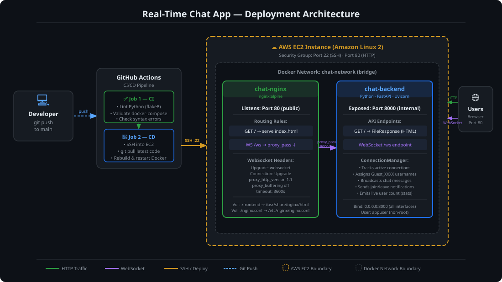

# 💬 Real-Time Chat Application
### DevOps Engineering Assignment — Docker · Nginx · WebSockets · CI/CD

---

## 🌍 Live Public IP

> **The application is live and accessible at:**
>
> ### 👉 `http://54.196.68.142`

To find your EC2 public IP after deploying with Terraform:
```bash
cd terraform/
terraform output ec2_public_ip
```

--- 

## 📋 Table of Contents

1. [Live Public IP](#-live-public-ip)
2. [Project Overview](#-project-overview)
3. [Architecture Diagram](#-architecture-diagram)
4. [Docker Container Setup](#-docker-container-setup)
5. [Docker Networking](#-docker-networking)
6. [Nginx Reverse Proxy](#-nginx-reverse-proxy)
7. [WebSocket Through Nginx](#-websocket-through-nginx)
8. [CI/CD Pipeline](#-cicd-pipeline)
9. [Bugs Found & Fixed](#-bugs-found--fixed)
10. [Deployment Steps](#-deployment-steps)

---

## 🌐 Project Overview

This is a **production-grade, real-time group chat application** built with:

| Layer | Technology | Role |
|---|---|---|
| **Backend** | Python · FastAPI · Uvicorn | WebSocket server on port `8000` |
| **Frontend** | HTML · CSS · JavaScript | Single-page chat UI |
| **Proxy** | Nginx (Alpine) | Static file server + WebSocket reverse proxy on port `80` |
| **Containerization** | Docker · Docker Compose | Isolated, reproducible services |
| **Infrastructure** | AWS EC2 · Terraform | Cloud server provisioning |
| **CI/CD** | GitHub Actions | Automated deployment on every push |

### How it works

Multiple users open `http://<server-ip>` in their browsers. Nginx serves the static HTML frontend and transparently proxies every WebSocket connection (`/ws`) to the FastAPI backend. The backend manages all connected clients and broadcasts messages to every participant in real time.

---

## 🏗 Architecture Diagram



> The diagram above shows the full deployment pipeline:  
> **Developer push → GitHub Actions CI/CD → SSH to EC2 → Docker rebuild → Live app**

### Text Diagram (fallback)

```
                        ┌─────────────────────────────────────────┐
                        │           AWS EC2 Instance               │
                        │                                          │
  User Browser          │   ┌──────────────────────────────────┐  │
  ───────────           │   │     Docker Network: chat-network  │  │
  HTTP  GET /           │   │                                   │  │
  ──────────────────────┼──►│  ┌─────────────────────────┐     │  │
                        │   │  │   chat-nginx (port 80)  │     │  │
  WS   ws://host/ws     │   │  │   image: nginx:alpine   │     │  │
  ──────────────────────┼──►│  │                         │     │  │
                        │   │  │  / → serves index.html  │     │  │
                        │   │  │  /ws → proxy_pass ──────┼──┐  │  │
                        │   │  └─────────────────────────┘  │  │  │
                        │   │                                │  │  │
                        │   │  ┌─────────────────────────┐  │  │  │
                        │   │  │ chat-backend (port 8000) │◄─┘  │  │
                        │   │  │ image: devops-backend    │     │  │
                        │   │  │                          │     │  │
                        │   │  │  FastAPI + Uvicorn       │     │  │
                        │   │  │  WebSocket /ws endpoint  │     │  │
                        │   │  └─────────────────────────┘  │  │  │
                        │   └──────────────────────────────────┘  │
                        └─────────────────────────────────────────┘
```

---


## 🐳 Docker Container Setup

The application runs **two containers** defined in `docker-compose.yml`:

### Container 1 — `chat-backend`

Built from the project's custom `Dockerfile` using a **multi-stage build**:

```
Stage 1 (builder)          Stage 2 (runtime)
──────────────────         ──────────────────
python:3.11-slim           python:3.11-slim
    │                          │
    ├── Copy requirements.txt  ├── Copy installed packages from Stage 1
    └── pip install            ├── Copy app/main.py (with correct ownership)
         (into /install)       ├── Non-root user: appuser
                               ├── EXPOSE 8000
                               └── CMD uvicorn main:app --host 0.0.0.0 --port 8000
```

**Why multi-stage?**
- Stage 1 installs all build-time dependencies
- Stage 2 copies only the compiled packages — no build tools in the final image
- Final image is significantly smaller and more secure

**Why non-root user?**
- Running as `appuser` (not root) follows the principle of least privilege
- Reduces the blast radius if the container is ever compromised

```yaml
# docker-compose.yml — backend service
backend:
  build:
    context: .
    dockerfile: Dockerfile
  container_name: chat-backend
  expose:
    - "8000"           # Internal only — NOT published to host
  restart: unless-stopped
  networks:
    - chat-network
```

> `expose` vs `ports`: `expose` makes port 8000 available **only inside the Docker network** (to Nginx). It is never exposed directly to the internet.

---

### Container 2 — `chat-nginx`

Uses the official lightweight `nginx:alpine` image:

```yaml
# docker-compose.yml — nginx service
nginx:
  image: nginx:alpine
  container_name: chat-nginx
  ports:
    - "80:80"          # Maps host port 80 → container port 80
  volumes:
    - ./frontend:/usr/share/nginx/html:ro   # Serves static files (read-only)
    - ./nginx.conf:/etc/nginx/nginx.conf:ro # Custom config (read-only)
  depends_on:
    - backend          # Nginx starts only after backend is ready
  restart: unless-stopped
  networks:
    - chat-network
```

**Volume mounts** (`:ro` = read-only for security):
- `./frontend` → `/usr/share/nginx/html` — Nginx serves `index.html` from here
- `./nginx.conf` → `/etc/nginx/nginx.conf` — Replaces the default Nginx config

---

## 🔗 Docker Networking

Both containers share a **user-defined bridge network** called `chat-network`:

```yaml
networks:
  chat-network:
    name: chat-network
    driver: bridge
```

### How container-to-container communication works

| Without Docker Network | With `chat-network` |
|---|---|
| Containers are isolated by default | Containers can reach each other by **service name** |
| Must expose ports to the host | No host port needed for internal traffic |
| `localhost` inside Nginx = Nginx itself | `http://backend:8000` resolves to the backend container |

```
chat-nginx  ──── proxy_pass http://backend:8000/ws ────► chat-backend
    │                                                          │
    │  Docker DNS resolves "backend"                           │
    │  to the container's internal IP automatically            │
    └──────────────────────────────────────────────────────────┘
                        chat-network (bridge)
```

**Key rule:** Inside a Docker network, containers communicate using their **service name** (defined in `docker-compose.yml`), not `localhost` or `127.0.0.1`. Using `localhost` inside Nginx would point back to the Nginx container itself — not the backend.

---

## 🔀 Nginx Reverse Proxy

Nginx acts as the **single entry point** for all traffic on port `80`:

```nginx
server {
    listen 80;
    server_name _;

    root /usr/share/nginx/html;
    index index.html;

    # Route 1 — Serve the frontend SPA
    location / {
        try_files $uri $uri/ /index.html;
    }

    # Route 2 — Proxy WebSocket connections to the backend
    location /ws {
        proxy_pass http://backend:8000/ws;
        ...
    }
}
```

### Request routing table

| URL Path | What Nginx does |
|---|---|
| `GET /` | Serves `frontend/index.html` from disk |
| `GET /favicon.ico` | Serves from `/usr/share/nginx/html` |
| `WS /ws` | Proxies the WebSocket to `chat-backend:8000/ws` |

### Security headers configured

```nginx
server_tokens off;          # Hides Nginx version from responses
client_max_body_size 10M;   # Limits upload size
```

---

## ⚡ WebSocket Through Nginx

WebSocket is a persistent, full-duplex protocol. A standard HTTP proxy like Nginx needs **special configuration** to upgrade the connection from HTTP to WebSocket.

### The WebSocket handshake flow

```
Browser                       Nginx                      FastAPI
   │                             │                           │
   │── HTTP GET /ws ─────────────►│                           │
   │   Upgrade: websocket        │                           │
   │   Connection: Upgrade       │                           │
   │                             │── HTTP GET /ws ───────────►│
   │                             │   (with Upgrade headers)  │
   │                             │◄── 101 Switching Protocols─│
   │◄── 101 Switching Protocols ─│                           │
   │                             │                           │
   │◄════════ WebSocket tunnel (persistent) ═════════════════►│
   │          send/receive messages in real time              │
```

### Required Nginx headers for WebSocket

```nginx
location /ws {
    proxy_pass http://backend:8000/ws;

    proxy_http_version 1.1;                       # HTTP/1.1 required for WebSocket

    proxy_set_header Upgrade $http_upgrade;        # Forward the Upgrade request
    proxy_set_header Connection "Upgrade";         # Signal connection upgrade

    proxy_set_header Host $host;
    proxy_set_header X-Real-IP $remote_addr;       # Pass real client IP
    proxy_set_header X-Forwarded-For $proxy_add_x_forwarded_for;
    proxy_set_header X-Forwarded-Proto $scheme;

    proxy_read_timeout 3600;                       # Keep WS alive for 1 hour
    proxy_send_timeout 3600;

    proxy_buffering off;                           # Real-time: do not buffer
}
```

Without `Upgrade` and `Connection` headers, Nginx would close the connection after the first HTTP response — WebSocket would fail.

---

## ⚙️ CI/CD Pipeline

The pipeline lives in `.github/workflows/deploy.yml` and triggers automatically **on every push to `main`**.

### Pipeline overview

```
git push to main
       │
       ▼
┌─────────────────────────────────┐
│   Job 1: CI — Validate          │
│                                 │
│  1. Checkout code               │
│  2. Install Python 3.11         │
│  3. pip install requirements    │
│  4. flake8 lint (syntax check)  │
│  5. docker compose config       │
└────────────┬────────────────────┘
             │  (must pass)
             ▼
┌─────────────────────────────────┐
│   Job 2: CD — Deploy to EC2     │
│                                 │
│  1. Configure SSH key           │
│  2. SSH into EC2                │
│  3. cd ~/app                    │
│  4. git fetch + reset --hard    │
│  5. docker compose build        │
│  6. docker compose up -d        │
│  7. docker system prune -f      │
│  8. curl health check           │
│  9. Delete SSH key from memory  │
└─────────────────────────────────┘
```

### GitHub Secrets required

Navigate to: **GitHub Repo → Settings → Secrets and variables → Actions**

| Secret Name | Value |
|---|---|
| `EC2_HOST` | EC2 public IP address (e.g. `13.234.56.78`) |
| `EC2_USER` | `ec2-user` |
| `EC2_SSH_PRIVATE_KEY` | Full contents of your `.pem` private key file |

### Concurrency control

```yaml
concurrency:
  group: deploy-${{ github.ref }}
  cancel-in-progress: true
```

If two pushes happen in quick succession, the older deployment is **cancelled automatically** — preventing race conditions on the server.

---

## 🐛 Bugs Found & How They Were Fixed

The original code had **3 critical bugs** that prevented the application from working.

---

### Bug 1 — FastAPI Binding to Wrong Host

**File:** `Dockerfile`

**Problem:** Uvicorn was configured to bind to `127.0.0.1` (localhost). Inside a Docker container, `localhost` only refers to the container's internal loopback interface — other containers (including Nginx) **cannot reach it**.

```dockerfile
# ❌ BEFORE — unreachable from other containers
CMD ["uvicorn", "main:app", "--host", "127.0.0.1", "--port", "8000"]
```

```dockerfile
# ✅ AFTER — listens on all interfaces, reachable on the Docker network
CMD ["uvicorn", "main:app", "--host", "0.0.0.0", "--port", "8000"]
```

**Impact:** Without this fix, Nginx received a `Connection refused` error on every request to the backend, causing the app to never load.

---

### Bug 2 — Missing Frontend Volume Mount

**File:** `docker-compose.yml`

**Problem:** The `nginx` service had no volume mount for the `frontend/` directory. Nginx served its **default "Welcome to nginx!"** page because it had no access to `index.html`.

```yaml
# ❌ BEFORE — no frontend files mounted
nginx:
  image: nginx:alpine
  volumes:
    - ./nginx.conf:/etc/nginx/nginx.conf:ro
    # frontend volume was missing!
```

```yaml
# ✅ AFTER — frontend directory mounted correctly
nginx:
  image: nginx:alpine
  volumes:
    - ./frontend:/usr/share/nginx/html:ro    # ← added this line
    - ./nginx.conf:/etc/nginx/nginx.conf:ro
```

**Impact:** Without this fix, users saw the Nginx default page instead of the chat UI.

---

### Bug 3 — Broken WebSocket Proxy in Nginx

**File:** `nginx.conf`

**Problem:** Two sub-bugs in the WebSocket proxy block:

**3a — Wrong proxy target (`localhost` instead of `backend`)**

```nginx
# ❌ BEFORE — localhost inside Nginx container = Nginx itself, not the backend
proxy_pass http://localhost:8000/ws;
```

```nginx
# ✅ AFTER — use the Docker service name to reach the backend container
proxy_pass http://backend:8000/ws;
```

**3b — Missing WebSocket upgrade headers**

```nginx
# ❌ BEFORE — missing required headers, HTTP connection never upgraded to WebSocket
location /ws {
    proxy_pass http://backend:8000/ws;
    # No Upgrade or Connection headers!
}
```

```nginx
# ✅ AFTER — all required WebSocket headers present
location /ws {
    proxy_pass http://backend:8000/ws;
    proxy_http_version 1.1;
    proxy_set_header Upgrade $http_upgrade;    # ← required for WS handshake
    proxy_set_header Connection "Upgrade";     # ← required for WS handshake
    proxy_set_header Host $host;
    proxy_buffering off;
    proxy_read_timeout 3600;
    proxy_send_timeout 3600;
}
```

**Impact:** Without these fixes, the browser could connect to the page but the WebSocket handshake failed — chat showed "Disconnected" permanently.

---

### Summary of All Fixes

| # | File | Bug | Fix |
|---|---|---|---|
| 1 | `Dockerfile` | Uvicorn bound to `127.0.0.1` | Changed to `0.0.0.0` |
| 2 | `docker-compose.yml` | No volume mount for frontend | Added `./frontend:/usr/share/nginx/html:ro` |
| 3a | `nginx.conf` | `proxy_pass localhost` | Changed to `proxy_pass http://backend:8000/ws` |
| 3b | `nginx.conf` | Missing `Upgrade`/`Connection` headers | Added all required WebSocket headers |

---

## 🚀 Deployment Steps

### Prerequisites

- AWS EC2 instance (Amazon Linux 2) running — provisioned via Terraform
- Security Group open on ports **22** (SSH) and **80** (HTTP)
- Your `.pem` key file for SSH access
- A GitHub repository with this code

---

### Step 1 — One-time EC2 Server Setup

Copy and run the bootstrap script on your server:

```bash
# From your local machine — copy the script to EC2
scp -i your-key.pem server-setup.sh ec2-user@<EC2_PUBLIC_IP>:~/

# SSH into EC2
ssh -i your-key.pem ec2-user@<EC2_PUBLIC_IP>

# Run the bootstrap script (replace with your actual GitHub repo URL)
bash ~/server-setup.sh https://github.com/YOUR_USERNAME/YOUR_REPO.git
```

This automatically installs Git, Docker, Docker Compose V2, clones your repo to `~/app`, and runs the first deployment.

---

### Step 2 — Configure GitHub Secrets

In your GitHub repository:
**Settings → Secrets and variables → Actions → New repository secret**

| Secret | Value |
|---|---|
| `EC2_HOST` | Your EC2 public IP |
| `EC2_USER` | `ec2-user` |
| `EC2_SSH_PRIVATE_KEY` | Full `.pem` key content (including header/footer) |

---

### Step 3 — Deploy (Manual — First Time Only)

If you want to deploy manually without waiting for a push:

```bash
# SSH into EC2
ssh -i your-key.pem ec2-user@<EC2_PUBLIC_IP>

# Navigate to app directory
cd ~/app

# Build images and start all containers
docker compose up -d --build

# Verify containers are running
docker compose ps
```

---

### Step 4 — Automated Deployment (Every Push)

After secrets are configured, every push to `main` auto-deploys:

```bash
git add .
git commit -m "Your change description"
git push origin main

# Watch the pipeline: GitHub → Actions tab
```

---

### Step 5 — Verify the Deployment

```bash
# Check containers are up
docker compose ps

# View live logs
docker compose logs -f

# Test HTTP response
curl -I http://localhost
```

Open your browser: **`http://<EC2_PUBLIC_IP>`**

You should see the chat UI. Open multiple tabs to test real-time messaging.

---

### Useful Commands

```bash
# Stop all containers
docker compose down

# Rebuild a specific service
docker compose build backend

# View backend logs only
docker compose logs -f backend

# View nginx logs only
docker compose logs -f nginx

# Remove all stopped containers and unused images
docker system prune -f
```

---

## 📁 Project Structure

```
devops/
├── .github/
│   └── workflows/
│       └── deploy.yml          # GitHub Actions CI/CD pipeline
├── app/
│   ├── main.py                 # FastAPI WebSocket server
│   └── requirements.txt        # Python dependencies
├── frontend/
│   └── index.html              # Single-page chat UI
├── Dockerfile                  # Multi-stage Python backend image
├── docker-compose.yml          # Composes nginx + backend services
├── nginx.conf                  # Nginx routing + WebSocket proxy config
├── server-setup.sh             # One-time EC2 bootstrap script
├── .gitignore
└── README.md
```

---

*Built as part of the DevOps Engineering Assignment.*
